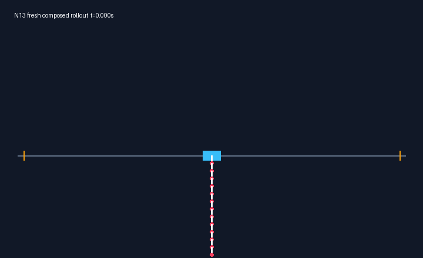

# N13 deterministic one-run proof



This README limits scope to one deterministic, unperturbed N13 simulation from exact hanging through the locked handoff and success set (`deterministic_one_run_proof`).

```text
uv sync --locked
uv run n13-demo
uv run n13-proof-verify
```

`n13-demo` loads the frozen B0 nominal states and controls as its tracking reference, the Arm-A static gain, and the B2 affine controller. It computes each control from the current state, advances the native plant with four 0.25 ms RK4 steps per 1 kHz tick, and renders only the newly integrated states to `.working/n13-demo.gif`. The saved B2 proof rollout never supplies animation states.

`n13-proof-verify` checks the SHA-256 of the separately preserved `.working/n13-retrospective/b2-proof-verify.py`, then runs it unchanged. The command reports its host-specific byte verdict. A separate portable gate requires intact source closure, fresh finite closed-loop motion within the rail and force bound, the locked switch predicate, and 9.048 s trailing success. It does not claim byte-identical trajectories across numerical platforms.

`evidence/copy-manifest.json` records all 27 copied inputs with source path, SHA-256, size, and category. The B2 source manifest locks the ten-file runtime closure. The capsule reports every authority input it loads.

This README excludes perturbation robustness, release seed gates, `72/72` promotion, statistical robustness, formal guarantees, and hardware behavior. The capsule contains no optimizer run or promotion decision.
